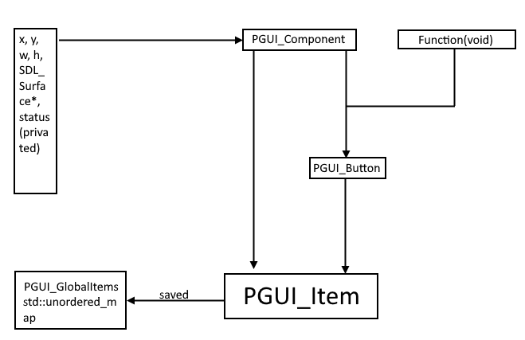

## PeakyGUI / (PGUI.hpp)

*Warning:*
> THE PRODUCED EXECUTABLE HAS TO BE IN THE SAME DIR AS THE SDL2 DLL FILES.

## Info

This is a custom made GUI library made to ease GUI construction in SDL2, C/C++.
The library is based currently on SDL2, and requires a Basic SDL cycle for it to work correctly (exmpl: https://github.com/GpapPeaky/Basic-SDL2).

Source code is included inside the PeakyGUI folder, as well as temporary assets (You can of course use your own).

## How to Use

We firstly need to know what we need a UI for, for example, we require a button that executes a certain algorithm / function, or maybe it creates a different button ect.

The UI's structure goes like this

`PGUI_Component && Function(void) -> PGUI_Button`

`PGUI_Component & {PGUI_Button1, PGUI_Button2 ...} -> PGUI_Item`



## Understanding PeakyGUI

### Creating components, buttons and items

```cpp

    /* We create a component for the close button. */
    PGUI_Component clsCmp = PGUI_CreateComponent(0, 0, PGUI_UNDECIDED_VALUE, PGUI_UNDECIDED_VALUE, IMG_Load("PeakyGUI/assets/cls.png"), rnd);

    /* Then we need to write a function to call, when pressed. */
    void PGUI_Close(void){
        exit(PGUI_EXIT);
    }

    /* And finally we create the PGUI_Button, that has as parameters the function we created, and the component. */

    PGUI_Button clsButt = PGUI_CreateButton(PGUI_Close, clsCmp);

```
```cpp
    /* But created buttons are not to be accessed like this,
    we mash them together into "items" (PGUI_Item), that usually consist of a background Component
    and a list of PGUI_Buttons. */

    /* Let's say we have created 3 PGUI_Buttons {butt1, butt2, butt3} that we want that item to have */

    /* We now have to create a new component for the background of the PGUI_Item */

    PGUI_Component leftBarCmp = PGUI_CreateComponent(0, 0, PGUI_UNDECIDED_VALUE, PGUI_UNDECIDED_VALUE, IMG_Load("PeakyGUI/assets/leftbar.png"), rnd);

    /* We can now create a PGUI_Item like this */
    /* This syntax is valid */
    PGUI_Item leftBarItem = PGUI_CreateItem(leftBarCmp, {butt1, butt2, butt3});
    /* This is also valid */
    PGUI_Item Item = PGUI_CreateItem(ItemCmp, { butt1 });
    /* We can think of the Item.itemComponent as a background for the item's buttons (Item.itemButtons) */
```
### Events and Rendering

```cpp
    /* I strongly advise that UI elements are organised into PGUI_Items instead of their field types */
    /* The PGUI_Items are all saved in a std::unordered_map PGUI_GlobalItems, buttons and components are all local */
    /* The button press check and the rendering, access this map */
    /* Now since we have an item ready, we need to add our button press check, execution, and item drawing functions */
    /* We simply need to call 2 functions (The Button press check and execution are combined into one function) */
    /* We call the rendering function in between the SDL_RenderClear() and SDL_RenderPresent() functions */
    while(!quit){
        /* Updates to assets / sprites */
        handle_events(quit); /* Creates a new event to poll per call */

        /* Render functions */
        SDL_RenderClear(rnd);

        PGUI_DrawItems(rnd);

        SDL_RenderPresent(rnd);
    }

    /* It is important that events and calls in PGUI are redefined, and are, simply put, functions that are called when the mouse coordinates are inside a button's rectangle */
    /* If a background component is clicked, simply nothing happens */

    /* You will notice another function, handle_events */
    /* This function handles all events for SDL_main, (mouse clicks, keyboard input ...) */
    /* We simply need to use the mouse to press a button, so when a click is registered, we check
    it's coordinates */
    /* If the function PGUI_ButtonPressed returns true, the buttons action (The function we assigned it) will be called */
    /* The handle event function should look like this */

    void handle_events(bool& quit){
        SDL_Event e;

        while(SDL_PollEvent(&e)){
            if(e.type == SDL_QUIT || (e.type == SDL_KEYDOWN && (e.key.keysym.sym == SDLK_ESCAPE || e.key.keysym.sym == SDLK_e))){
                quit = true;
            }
            if(e.type == SDL_MOUSEBUTTONDOWN){
                if(e.button.button == SDL_BUTTON_LEFT){
                    /* Check for button interactions */
                    SDL_GetMouseState(&mouse_x, &mouse_y);
                    PGUI_EventCycle(mouse_x, mouse_y);
                }
            }
        }

        return;
    }

/* Most code here is SDL2 exclusive, we only need to focus on the 1 line regarding the function PGUI_EventCycle */
void PGUI_EventCycle(int x, int y){
    for(auto it = PGUI_GlobalItems.begin() ; it != PGUI_GlobalItems.end() ; ++it){
        PGUI_Item& item = it->second;
        
        for(auto butt : item.itemButtons){
            if(PGUI_ButtonPressed(butt, x, y) == PGUI_True){
                PGUI_ExecuteButtonAction(butt);
            }
        }
    }

    return;
}
/* As mentioned earlier, we check if a button is pressed, O[1] complexity due to the map (same as the rendering), and we execute the action */
/* I advise for the source code to be accessed for completely understanding the mechanism of the GUI */

```

## Examples

The repository provides source code for an example of a PeakyGUI application, inside the PGUI_TestSource folder.

## Warning

It is important to note that the functions that can be registered as a PGUI_Action, are to be functions with no parameters, at least for now.

## Assets

There are currently no official PGUI assets, they will be added later into the module.

## TODOS

It is important to add the capability to pass as parameters functions (for button actions), so that we can be able to call any function with any number and type of arguments, by pressing a button.
